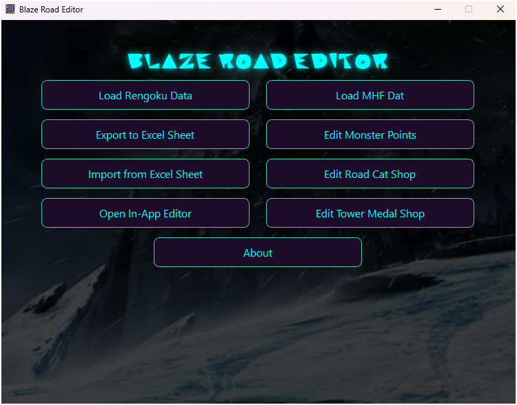
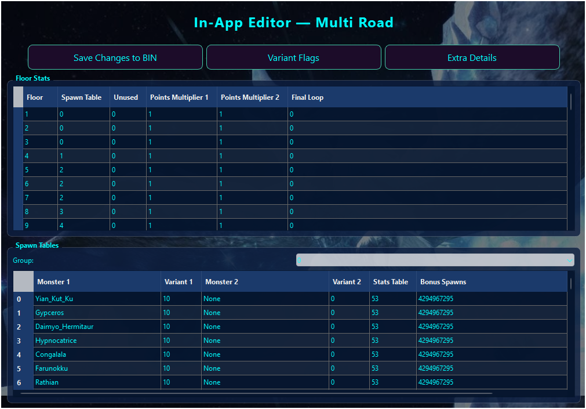
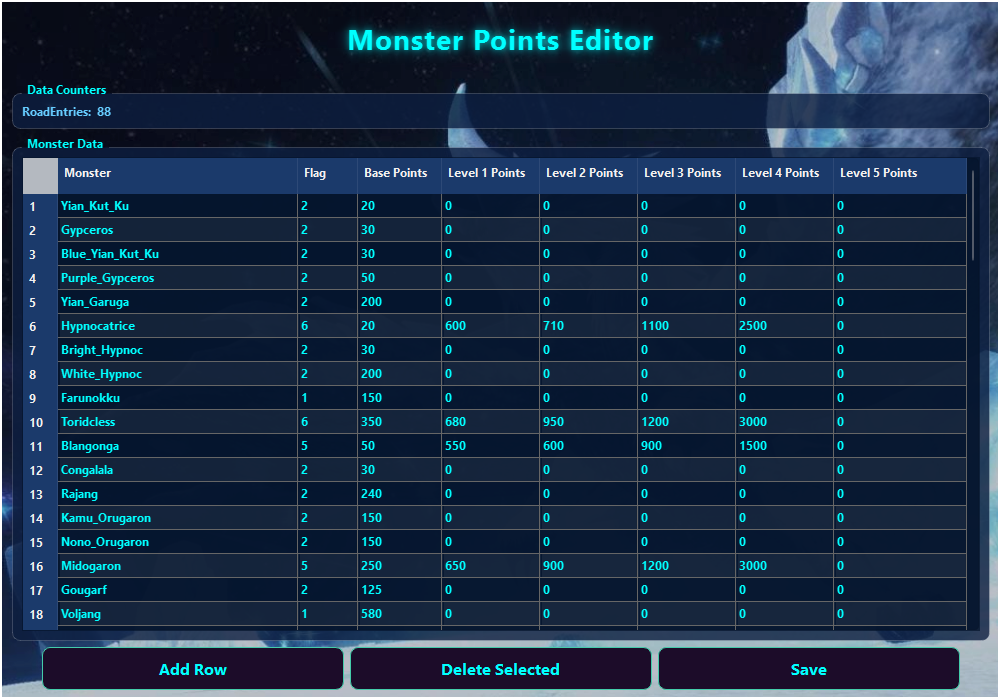

# BlazeRoadEditor

BlazeRoadEditor is a GUI tool designed for editing **Monster Hunter Frontier's Hunting Road (Rengoku)** data.  
It allows you to view, modify, and export both **Floor Stats** and **Spawn Tables**, and comes with support for Excel integration and an in-app editor.

---

## ✨ Features

- **Load Rengoku Data**
  - Open a `rengoku_data.bin` file and parse its contents into structured tables.
  - Required file must be named `rengoku_data.bin` and decompressed before loading.

- **Monster Points Editor**
  - Load a decompressed `mhfdat.bin` file using **Load mhfdat.bin**.
  - Once loaded, the **Edit Monster Points** button will be enabled.
  - Opens a dedicated in-app table editor for the **Monster Data** block inside `mhfdat.bin`.
  - Edit monster IDs, flags, base points, and level-based point values directly in the table.
  - Includes a `RoadEntries` counter field for editing. (This must match directly with the amount of monsters in the points table).
  - Uses dropdowns and spinboxes for safe, validated editing.
  - Ensures correct file type by validating the `mhfdat.bin` header before parsing.
  - Save your changes to a new `mhfdat.bin` while preserving all unrelated data.

- **Export to Excel**
  - Export Floor Stats and Spawn Tables into an `.xlsx` file.
  - Automatically includes Monster Key and Spawn Table Key sheets.

- **Import from Excel**
  - Edit the exported Excel file and import changes back into a template BIN file.
  - Writes your modifications directly into a new BIN.

- **In-App Editor**
  - Choose to edit **Multi Road** or **Solo Road**.
  - Edit Floor Stats and Spawn Tables directly in a modern table interface.
  - Cell editing is supported with dropdowns, spinboxes, and validation.
  - Variant Flags viewer included (shows monster variant details).
  - Extra Details viewer (loads bundled or external `extra_details.xlsx`).
---

## 📸 Screenshots

### Main App View

### In-App Editor View

### Monster Points Editor

---

## 📖 How to Use

1. **Load a BIN file**
   - Click **Load Rengoku Data** and select a valid, decompressed `rengoku_data.bin`.
   - Once loaded, the other buttons will become available.

2. **Export to Excel**
   - Click **Export to Excel** to save an editable `.xlsx` file.
   - Open this file in Excel (or Google Sheets) to make modifications.

3. **Import from Excel**
   - After editing your Excel, click **Import from Excel**.
   - Choose the `.xlsx` file, then provide a template BIN.
   - The program will output a new BIN with your changes applied.

4. **Open In-App Editor**
   - Click **Open In-App Editor** → select Multi or Solo.
   - Floor Stats and Spawn Tables will be displayed in two sections.
   - Edit cells directly
   - Use the **Save Changes to BIN** button to export modifications.
   - Use **Variant Flags** to view monster variant notes.
   - Use **Extra Details** to see the formatted details sheet.

5. **Monster Points Workflow**
   - Load a decompressed `mhfdat.bin`.
   - Click **Edit Monster Points** to adjust monster base points and RoadEntries.
   - Remember: the **base Monster Points used in Hunting Road are taken directly from mhfdat.bin**, so editing this file is required when adding monsters not normally present.

6. **About Button**
   - Displays quick instructions and feature summary inside the program.

---

## 🙌 Conclusion

The goal of this tool is to provide a resource for editing Hunting Road data and to make the process more accessible for anyone interested in experimenting with it.  
Any additional details, feedback, or contributions from the community are greatly appreciated.

If you encounter questions or issues, please visit the GitHub repository:  
[https://github.com/BlazeMH/Blaze-Hunting-Road-Editor](https://github.com/BlazeMH/Blaze-Hunting-Road-Editor)

---

## 🎖️ Credits

Thanks to these individuals for assisting with the project:

- [Brentdbr](https://github.com/Brentdbr) — for providing initial help on the outline of Hunting Road data and floor mapping patterns.  
- [ezemania2](https://github.com/ezemania2) — for testing.  
- **Sera** — for testing.  

---
