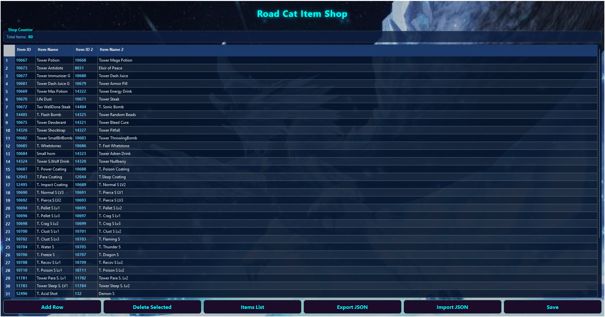
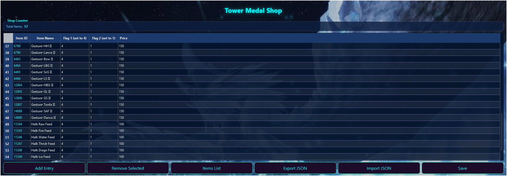

# Blaze Hunting Road Editor

Blaze Hunting Road Editor is a GUI tool for editing **Monster Hunter Frontier Z's Hunting Road** data and related systems.  
It allows you to view, modify, and export both Floor Stats and Spawn Tables, and comes with support for Excel integration and an in-app editor.

---

## ✨ Features
### 🔹 Rengoku Data (`rengoku_data.bin`)
- **Load Rengoku Data**
  - Open a decompressed `rengoku_data.bin` file to unlock all editing tools.
  - Automatically detects valid data and enables the proper features.

- **Export to Excel**
  - Save all Floor Stats and Spawn Tables into an editable `.xlsx` file.
  - Automatically includes Monster Key and Spawn Table Key sheets for quick reference.

- **Import from Excel**
  - Load your edited Excel file and apply the changes back into a new BIN.
  - Keeps all formatting and structure intact.

- **In-App Editor**
  - Choose between **Multi Road** or **Solo Road** mode.
  - Edit Floor Stats and Spawn Tables directly within the tool.
  - Includes dropdowns, spinboxes, and automatic validation for safety.
  - Optional **Variant Flags** and **Extra Details** viewers for quick monster info.

---

### 🔹 MHF Dat (`mhfdat.bin`)
- **Load MHF Dat**
  - Open a decompressed `mhfdat.bin` file to unlock all editing tools.
  - Automatically detects valid data and enables the proper features.

- **Monster Points Editor**
  - Adjust monster IDs, flags, and base point values used by the Hunting Road.
  - Includes a `RoadEntries` counter (keeps track of total monsters listed).
  - Built-in validation and dropdowns for safe editing.
  - Saves to a new BIN while preserving all unrelated data.

- **Road Cat Shop Editor**
  - Edit the **Road Cat Item Shop** in an easy-to-use table format.
  - Columns: **Item ID**, **Item Name**, **Item ID2**, **Item Name2** (auto-loaded from `Items.xlsx`).
  - Add or delete entries safely — the counter updates automatically.
  - Includes a searchable **Items List** popup for browsing items.
  - Supports **JSON Export/Import** for quick batch edits.
  - Automatically updates pointers and counters when saving.

- **Tower Medal Shop Editor**
  - Edit the **Tower Medal Shop** entries directly from `mhfdat.bin`.
  - Columns: **Item ID**, **Item Name**, **Flag1**, **Flag2**, and **Price**.
  - `Flag1` is always fixed to `4` after import/saving (read-only); `Flag2` is kept at `1`.
  - Quantity and Price validation ensures all entries are valid before saving.
  - Add or remove entries easily.
  - Supports **JSON Export/Import** and includes an **Items List** popup.
---
## 📸 Screenshots

### Main App View

### In-App Editor View

### Monster Points Editor

### Road Cat Shop Editor

### Tower Medal Shop Editor

---

## 📖 How to Use

1. **Load a BIN file**
   - Click **Load Rengoku Data** for `rengoku_data.bin`, or  
     **Load mhfdat.bin** for the related editors.
   - The relevant buttons will unlock once a valid file is loaded.

2. **Export to Excel** *(Rengoku only)*
   - Click **Export to Excel** to generate an editable `.xlsx` file.
   - Use Excel or Google Sheets to modify the data.

3. **Import from Excel** *(Rengoku only)*
   - After editing, click **Import from Excel** and choose your file.
   - The program writes changes back into a new BIN safely.

4. **Open In-App Editor**
   - Edit directly inside BlazeRoadEditor without needing Excel.
   - Choose Multi or Solo mode to view Floor Stats and Spawn Tables.
   - Use **Save Changes to BIN** to apply updates immediately.

5. **Monster Points Editor (mhfdat.bin)**
   - Adjust monster base points, flags, and RoadEntries.
   - Essential when adding monsters that don’t normally appear on Hunting Road.

6. **Road Cat Shop Editor (mhfdat.bin)**
   - Manage Cat Shop entries.
   - Add or delete rows, search items, and export/import JSON.

7. **Tower Medal Shop Editor (mhfdat.bin)**
   - Manage Medal Shop entries with editable item IDs and prices.
   - Flag values are fixed for consistency.
   - Supports JSON export/import for quick bulk edits.

8. **About Button**
   - Shows an overview of all features and quick usage tips directly inside the app.

---

## 🙌 Conclusion

BlazeRoadEditor is built to make **Hunting Road and related data editing** simple, visual, and safe.  
It’s designed for modders, researchers, and community developers who want to explore Monster Hunter Frontier’s data structure in an accessible way.

For questions, issues, or community collaboration, visit the GitHub repository:  
[https://github.com/BlazeMH/Blaze-Hunting-Road-Editor](https://github.com/BlazeMH/Blaze-Hunting-Road-Editor)

---

## 🎖️ Credits

Special thanks to those who helped with development and testing:

- [Brentdbr](https://github.com/Brentdbr) — for outlining the Hunting Road data structure.  
- [ezemania2](https://github.com/ezemania2) — for testing and feedback.  
- **Sera** — for continued testing and input.  
